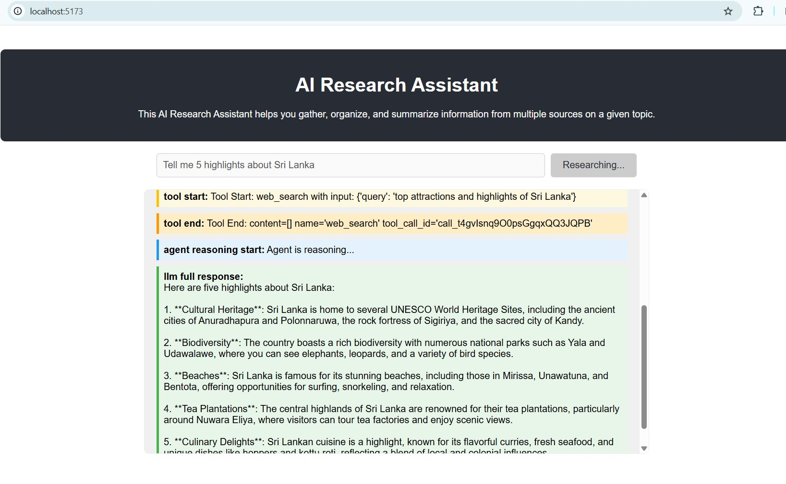
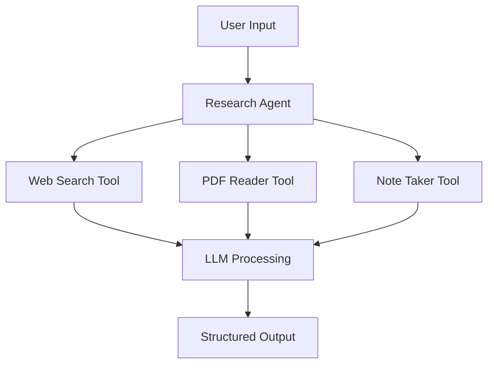
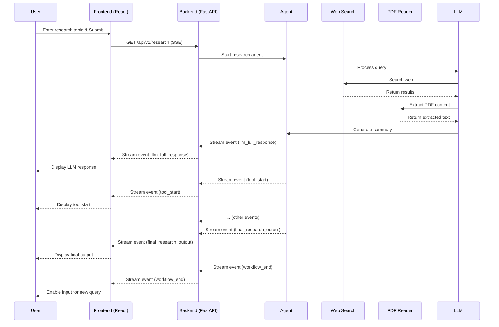

# AI Research Assistant

## Project Title and Description
This project implements an intelligent research assistant designed to help users gather, organize, and summarize information from multiple sources. It leverages LangChain concepts such as agents, tools, streaming, and structured outputs to provide a comprehensive and interactive research experience.

The assistant can:
- Accept research topics as natural language queries.
- Automatically search the web for relevant information.
- Download and parse PDF documents when relevant.
- Extract key information from multiple sources.
- Generate structured summaries with citations and confidence scores.

## User Interface (UI)
The project includes a React.js-based frontend application that allows users to easily submit research topics and view the streaming output from the AI Research Assistant in real-time. The UI provides visual feedback on the agent's progress, including LLM reasoning, tool invocations, and the final structured research output.



## Architecture Diagram


## Sequence Diagram


## Installation and Usage Instructions
For detailed step-by-step instructions on how to set up and run both the backend (FastAPI) and frontend (React.js) components, please refer to the [RUN_INSTRUCTIONS.md](RUN_INSTRUCTIONS.md) file.

## Configuration
The following environment variables are required:
- `OPENAI_API_KEY`: Your OpenAI API key for accessing the LLM.

## Project Structure
```
ai-research-assistant/
├── backend/                # FastAPI backend application
│   └── app.py
│   └── requirements.txt
├── frontend/               # React.js frontend application
│   └── public/
│   └── src/
│       └── App.jsx
│       └── App.css
│       └── main.jsx
│   └── index.html
│   └── package.json
├── src/
│   ├── agent.py          Main agent implementation
│   ├── tools/
│   │   ├── web_search.py
│   │   ├── pdf_reader.py
│   │   └── note_taker.py
│   ├── models.py         Pydantic models
│   └── utils.py          Helper functions
├── tests/
│   └── test_tools.py
├── requirements.txt
├── README.md
└── RUN_INSTRUCTIONS.md     # Detailed setup and usage guide
└── main.py                 # Original CLI entry point (still functional)
```

## Troubleshooting Section
For common issues and their solutions during setup and operation, please refer to the [Troubleshooting section in RUN_INSTRUCTIONS.md](RUN_INSTRUCTIONS.md#troubleshooting).
